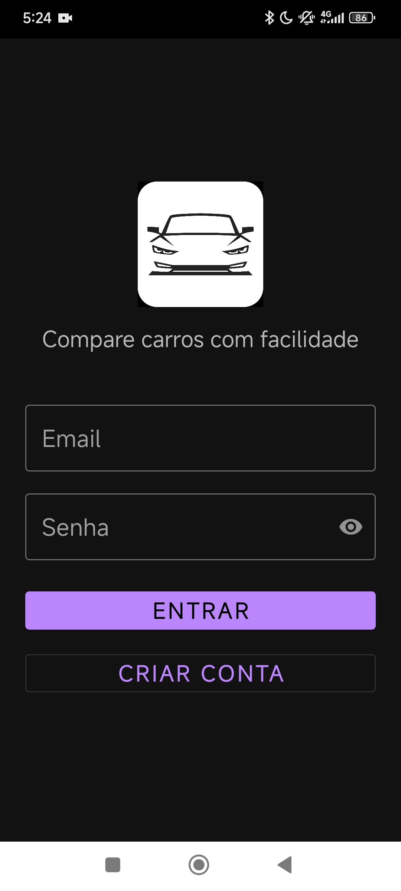
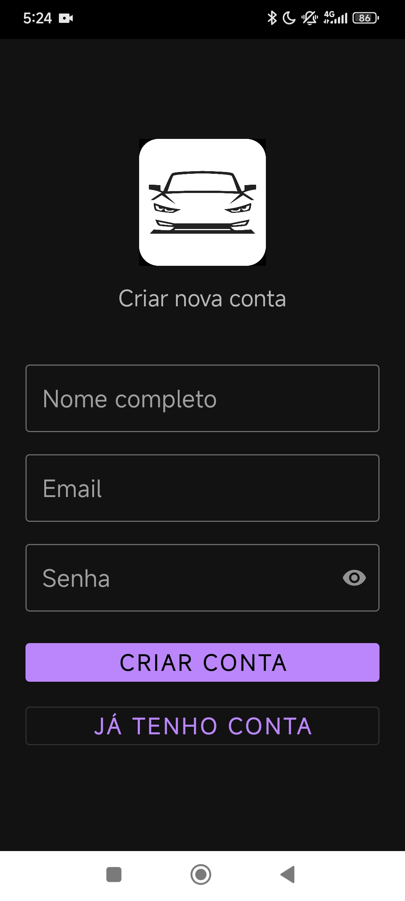
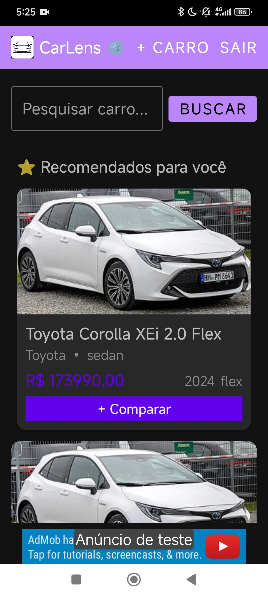
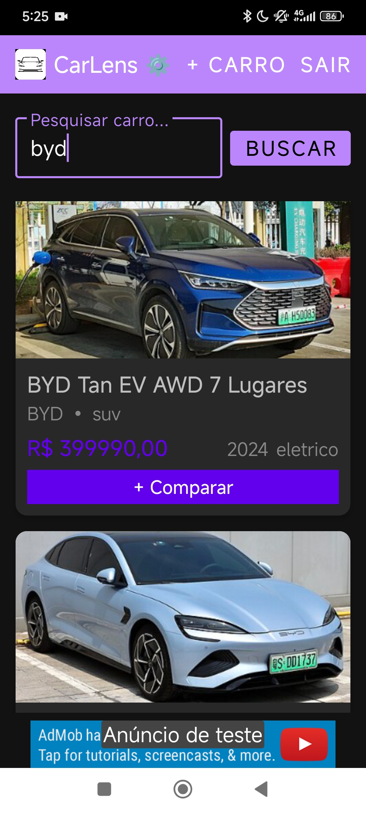
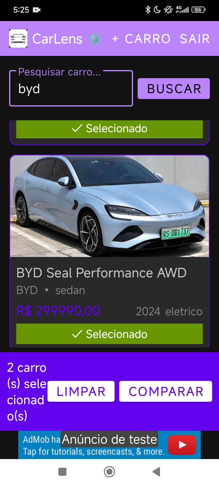
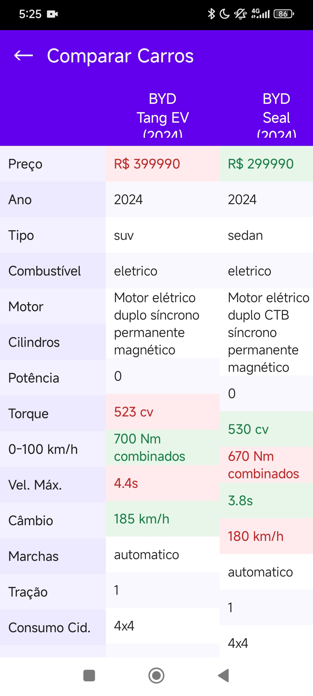

# CarLens

**Compare carros com facilidade**

---

## 📱 Sobre o Projeto

O **CarLens** é um aplicativo mobile Android para pesquisa, cadastro e **comparação técnica de veículos**. A proposta é centralizar informações de carros em um único lugar, permitindo que o usuário compare especificações lado a lado antes de tomar uma decisão de compra.

O app surgiu como projeto acadêmico e está sendo evoluído para um produto real, com sistema de anúncios integrado via AdMob e melhorias contínuas de UI/UX.

---

## ✨ Funcionalidades

- 🔐 **Autenticação** — login e cadastro de usuários com JWT + Bcrypt
- 🚗 **Listagem de carros** — catálogo com imagens, preço (Tabela FIPE), tipo e combustível
- 🔍 **Pesquisa com filtros** — busca por marca, modelo e características
- ⭐ **Recomendações personalizadas** — sugestões baseadas no perfil do usuário
- ⚖️ **Comparação técnica** — compare dois veículos lado a lado com destaque visual para vantagens e desvantagens
- ➕ **Cadastro de veículos** — formulário completo enviado para aprovação administrativa
- 🔗 **Redirecionamento** — links diretos para OLX e WebMotors
- 📢 **Anúncios integrados** — monetização via Google AdMob

---

## 🖼️ Screenshots

| Login | Cadastro | Home |
|-------|----------|------|
|  |  |  |

| Pesquisa | Seleção | Comparação |
|----------|---------|------------|
|  |  |  |

---

## 🛠️ Stack Tecnológica

### Mobile (Android)
- **Kotlin** — linguagem principal
- **Retrofit** — consumo da API REST
- **Glide** — carregamento e cache de imagens
- **AdMob** — sistema de anúncios
- **Arquitetura MVVM**

### Backend (API REST)
- **Node.js + Express** — servidor e rotas
- **MongoDB Atlas + Mongoose** — banco de dados NoSQL
- **JWT** — autenticação stateless
- **Bcrypt** — hash de senhas
- **Hospedado no Render**

---

## 🚀 Roadmap

- [x] Autenticação JWT
- [x] Listagem e pesquisa de veículos
- [x] Sistema de comparação técnica
- [x] Recomendações personalizadas
- [x] Cadastro de veículos com aprovação admin
- [x] Integração AdMob
- [x] Redirecionamento OLX / WebMotors
- [ ] Publicação na Google Play Store
- [ ] Melhorias de UI/UX
- [ ] Expandir base de veículos

---

## 👨‍💻 Desenvolvido por

**Matheus Cavalcanti Campos** — Backend (API REST, autenticação JWT, integração MongoDB)

---

  Projeto acadêmico em evolução • UNINASSAU Recife • 2025

